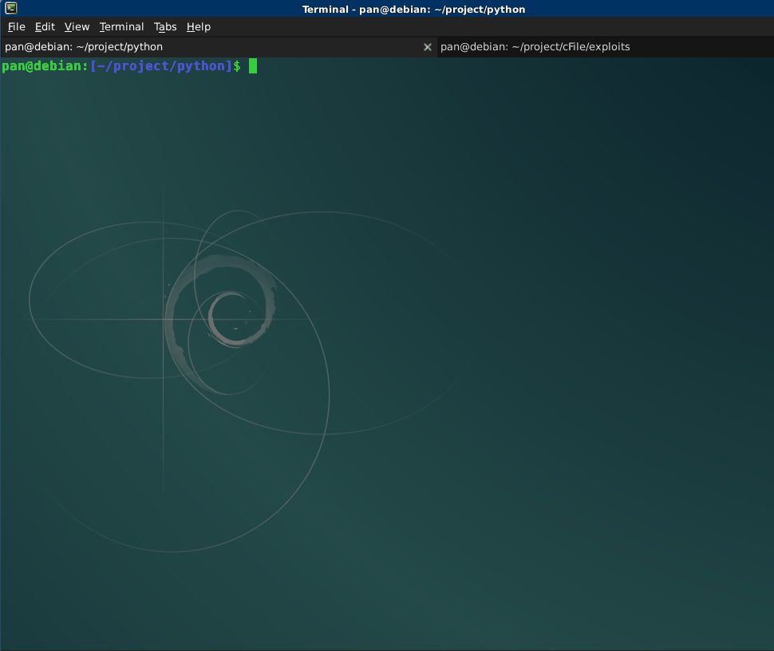
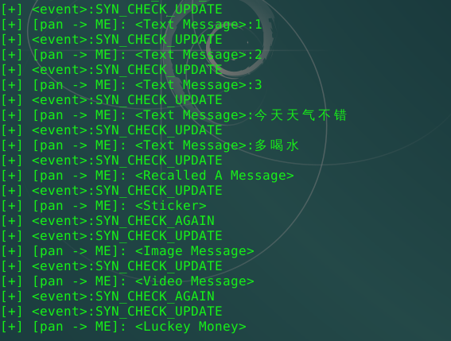
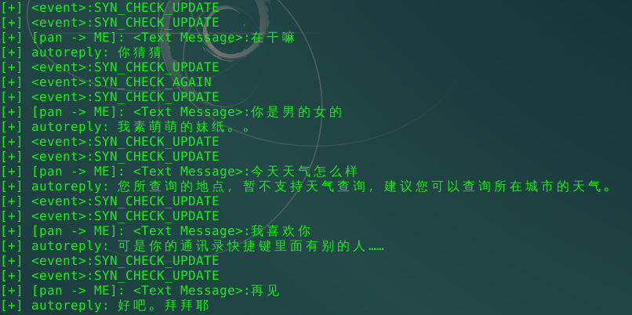
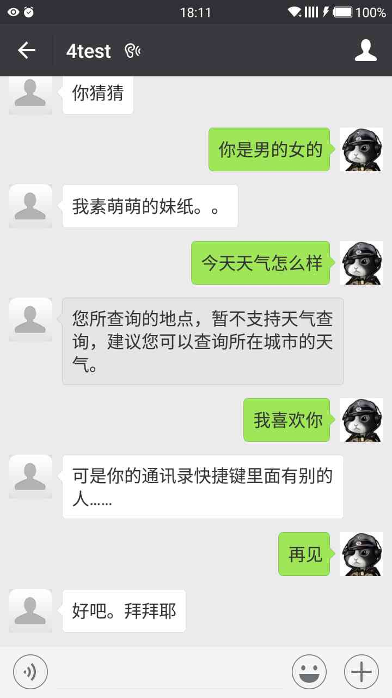

# 简介

pyweixin旨在实现一个基础的微信客户端模块，提供自定义回调接口来处理用户在微信
上的收发信息和基本事件。主要用于为有python编程基础的人提供一些自动化的能力，
如数据采集，自动回复，红包提醒等基本功能。当然也可以基于此模块实现上层的复杂应用。

pyweixin基于web微信所提供的接口进行封装，因此和web微信一样，采用的是
http long polling的方式进行消息的同步和事件提醒。

pyweixin封装了用户不需要关心的大部分协议交互和过程事件，因此使用起来比较简单。
对于简单的应用而言，用户只需要继承`MessageHandler`并且实现(覆写)
`on_message()`接口，则可以同步收到微信上收到的信息，并且决定是否回复。
另外有需要的用户也可以实现`on_event()`接口, 客户端运行时产生的一些事件，
如登录时等待用户扫描二维码/等待用户点击确认以及http轮询返回(synccheck)等。

另外，pyweixin中还包含一个Robot类，对接了几个免费的在线问答机器人。
可以用其来进行微信WxClient的自动回复。

# 依赖

需要安装的python包为lxml，qrcode以及requests，这三个应该算是比较常用的库了，
如果你的机器上没有的话，可以通过pip快速安装。

# 使用

```python
from pyweixin.client import MessageHandler,WxClient
def MyHandler(MessageHandler):
    def on_message(self, client, message):
        #接收到微信消息时此函数会被回调
    def on_event(self, client, message):
        #事件回调

handler = MyHandler()
wxclient = WxClient(handler)
#在后台启动微信客户端
wxclient.start_background() 
while True:
    sleep(9999)

```

一个简单的微信自动回复机器人的实现见[example.py](./example.py)

```
$ git clone https://github.com/pannzh/pyweixin
$ cd pyweixin
$ python example.py
```

# 截图示例

_登录_



_接收信息_



_自动回复_



_所有收发的信息会同步到微信客户端_



# FAQ

## 为什么用pyweixin？

因为简洁。在消息回调中，WxClient直接传入的是json格式的微信原始消息，
将消息的处理留给用户。这样可以节省许多用户不关心的消息处理代码，因为如果要
解析所有消息类型，必然导致代码无谓的膨胀，而且通常得不偿失。由此也可以将
pyweixin的代码量控制在500行左右，一目了然，利于二次开发。

## 有什么注意事项？

有两个要注意的地方：

### 不要阻塞MessageHandler的回调

pyweixin是单线程工作的，如果在消息回调`(on_message/on_event)`时要进行耗时的操作，
比如读写数据库，访问网络，最好在新的线程中运行，否则用户在接受大量消息时会阻塞。

### keepalive

在WxClient运行时，如果长时间未接收到消息，syncheck会快速返回，因此如果有必要的话，
在一段时间内如果未活动，可以手动进行激活。


# Others

在前人的基础上，做了点微小的工作，特别感谢：

- [reverland的行知阁](http://reverland.org/javascript/2016/01/15/webchat-user-bot/),web微信协议分析。
- [WeixinBot](https://github.com/Urinx/WeixinBot),console版本的微信实现。
